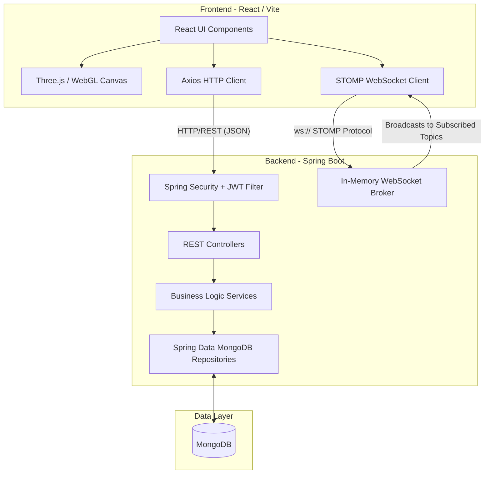

<div align="center">
  
  
  
  
  
</div>

<br/>

<div align="center">
  <h1 style="color: #00e5ff; font-family: 'Orbitron', sans-serif;">🛡️ DARKSHIELD</h1>
  <h3>Immersive Cybersecurity Operations Center (SOC)</h3>
  <p>A high-fidelity, real-time threat intelligence and digital forensics platform engineered for enterprise-grade incident response.</p>
</div>


---

## 📖 Executive Summary

**DarkShield** is a full-stack, real-time Security Operations Center (SOC) simulator and management platform. It ingests global threat intelligence, plots attacks on a fully interactive 3D WebGL globe, and provides security analysts with a complete NIST-compliant incident response pipeline. With integrated real-time WebSocket communications, automated vulnerability scanning, and strict Role-Based Access Control (RBAC), DarkShield bridges the gap between raw data and actionable cyber defense.

---

## ✨ Core Platform Features

### 🌍 Global Threat Visualization
* **3D Threat Globe**: Powered by Three.js and `@react-three/fiber`, rendering real-time ballistic arcs from attacker origins to target coordinates.
* **Domestic Impact Map**: An interactive SVG-based regional map (focused on India) that highlights targeted data centers with glassmorphic hover tooltips.
* **Live Telemetry Feed**: A scrolling, terminal-styled feed of incoming IOCs (Indicators of Compromise) sorted chronologically.

### 🚨 Incident Response Pipeline (NIST Framework)
Incidents are automatically generated when a threat's severity score exceeds the critical threshold (≥ 75).
* **Escalate (Investigating)**: Acknowledge the threat.
* **Contain (Containment)**: Isolate the affected network assets.
* **Eradicate (Eradication)**: Clean malware and patch vulnerabilities.
* **Recover (Recovery)**: Bring systems back online safely.
* **Resolve (Closed)**: Generate resolution notes and close the ticket.

### 💻 Asset & Vulnerability Management
* **Network Inventory**: Track all organizational servers, firewalls, and workstations.
* **Live Immersive Scanning**: A custom terminal-style modal that simulates an Nmap port scan, OS detection, and cross-references active open ports against the NVD (National Vulnerability Database) to find CVEs.
* **Dynamic Risk Scoring**: Assets display a glowing SVG `RiskRing` based on their computed vulnerability score.

### 💬 SOC Comms (Real-Time Team Chat)
* **Zero-Latency Communication**: Powered by Spring Boot STOMP WebSockets.
* **Role-Specific Channels**: Dedicated encrypted rooms for `#All Hands`, `#Hunters`, `#Analysts`, and `#Admins`.
* **Direct Messaging**: Secure peer-to-peer DMs for rapid incident coordination.

---

## 🏗️ System Architecture & Data Flow

DarkShield operates on a decoupled client-server architecture. The frontend handles immersive 3D rendering and state management, while the backend processes JWT authentication, database persistence, and WebSocket message brokering.



---

## 🛠️ Technology Stack

### Frontend (Client-Side)
* **Framework**: React 18, Vite
* **3D Engine**: Three.js, `@react-three/fiber`, `@react-three/drei`
* **Animations**: Framer Motion
* **Networking**: Axios, `@stomp/stompjs` (Native WebSockets)
* **Styling**: Vanilla CSS (Neon-Cyberpunk aesthetic, Glassmorphism)

### Backend (Server-Side)
* **Framework**: Java 26, Spring Boot 4
* **Security**: Spring Security, JJWT (JSON Web Tokens 0.12.5), BCrypt
* **WebSockets**: Spring `spring-boot-starter-websocket`
* **Database**: MongoDB & Spring Data MongoDB

---

## 🚀 Installation & Deployment

Follow these steps to deploy the DarkShield platform locally.

### 0. Prerequisites
* **Java Development Kit (JDK) 26**
* **Node.js v18+** & npm
* **MongoDB** (Running locally on `mongodb://localhost:27017`)

### 1. Backend Setup (Spring Boot)
Open a terminal and execute the following shell commands:

```bash
# Navigate to the backend directory
cd darkshield-backend

# Clean and build the application using Maven
mvn clean install

# Run the Spring Boot application
mvn spring-boot:run
```
*The backend will initialize and bind to `http://localhost:9091` (or `8080`). Ensure the port matches the frontend Axios configuration.*

### 2. Frontend Setup (React/Vite)
Open a **new** terminal window and execute:

```bash
# Navigate to the frontend directory
cd darkshield-frontend

# Install all Node modules and dependencies
npm install

# Start the Vite development server
npm run dev
```
*The frontend will be accessible at `http://localhost:5173`. Open this URL in your browser.*

---

## ⚙️ How the Platform Works (Operational Walkthrough)

1. **Authentication**: Users must register and log in. The backend issues a stateless JWT, which is stored in the browser's `localStorage` and attached as a `Bearer` token to all subsequent Axios requests.
2. **Threat Ingestion**: Analysts navigate to the **Threats** page to log new incoming attacks (e.g., Ransomware, DDoS). The system maps the target's location (e.g., Mumbai, Delhi) to exact latitude/longitude coordinates.
3. **Visualization**: The **Dashboard** and **Threat Globe** pull these coordinates from the database and render glowing attack arcs and impact zones in real-time.
4. **Auto-Escalation**: If a threat has a severity score of 75 or higher, the Spring Boot backend automatically creates a high-priority **Incident**.
5. **NIST Response**: A `ROLE_HUNTER` claims the incident and uses the dynamic UI buttons to progress the ticket: `Escalate` $\rightarrow$ `Contain` $\rightarrow$ `Eradicate` $\rightarrow$ `Recover` $\rightarrow$ `Resolve`.
6. **Asset Quarantine**: During the "Contain" phase, the Hunter navigates to the **Assets** page, runs the terminal scanner to verify vulnerabilities, and clicks the asset's status badge to switch it to `COMPROMISED` or `QUARANTINED`.
7. **Team Coordination**: Throughout the process, the team uses the **SOC Comms** (Chat) to send real-time WebSocket messages across encrypted role-based channels.

---

## 📂 Detailed Directory Structure

```text
📦 DARKSHIELD
 ┣ 📂 darkshield-backend                 # BACKEND: Spring Boot
 ┃ ┣ 📂 src/main/java/com/darkshield
 ┃ ┃ ┣ 📂 config                         # CORS, Security, MongoDB, WebSocket Configs
 ┃ ┃ ┣ 📂 controller                     # REST APIs (Auth, Threats, Incidents, Assets)
 ┃ ┃ ┣ 📂 dto                            # Data Transfer Objects (Requests/Responses)
 ┃ ┃ ┣ 📂 exception                      # Global Exception Handlers
 ┃ ┃ ┣ 📂 model                          # MongoDB Document Entities & Enums
 ┃ ┃ ┣ 📂 repository                     # Spring Data Mongo Repositories
 ┃ ┃ ┣ 📂 security                       # JWT Filters, UserDetails, EntryPoints
 ┃ ┃ ┗ 📂 service                        # Core Business Logic & Workflows
 ┃ ┣ 📜 pom.xml                          # Maven Build Definitions
 ┃ ┗ 📜 .gitignore                       # Java/Maven Ignore Rules
 ┃
 ┣ 📂 darkshield-frontend                # FRONTEND: React / Vite
 ┃ ┣ 📂 public                           # Static assets, Earth textures
 ┃ ┣ 📂 src'
 ┃ ┃ ┣ 📂 api                            # Axios instances & interceptors
 ┃ ┃ ┣ 📂 components                     # Reusable UI (Sidebar, IndiaMap, AssetCard)
 ┃ ┃ ┣ 📂 context                        # React Context API (AuthContext)
 ┃ ┃ ┣ 📂 pages                          # Route Views (Dashboard, Globe, Chat, etc.)
 ┃ ┃ ┣ 📜 App.jsx                        # React Router Configuration
 ┃ ┃ ┣ 📜 index.css                      # Global Neon/Glassmorphic CSS Variables
 ┃ ┃ ┗ 📜 main.jsx                       # React DOM Entry Point
 ┃ ┣ 📜 package.json                     # NPM Dependencies & Scripts
 ┃ ┣ 📜 vite.config.js                   # Vite Build & Polyfill Settings
 ┃ ┗ 📜 .gitignore                       # Node/Vite Ignore Rules
 ┃
 ┗ 📜 README.md                          # Main Project Documentation
```

---

<div align="center">
  <p><i>"Defending the digital frontier, one packet at a time."</i></p>
  <p><b>Powered by Spring Boot & React</b></p>
</div>
